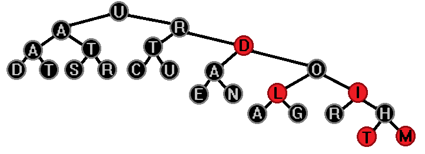

# Data-Structure-and-Algorithm
Data structures and Algorithms inspired by the book: [Introduction to Algorithms by CLRS](https://en.wikipedia.org/wiki/Introduction_to_Algorithms)

All code and pseudocode by me.

Modified Counting Sort, it can deal with negative numbers

Feel free to used any of the code. [MIT License](https://github.com/GrisWoldDiablo/Data-Structure-and-Algorithm/blob/master/LICENSE)

*`PS: This project is a work in progress.`*
## Sorting Algorithms *[Wikipedia](https://en.wikipedia.org/wiki/Sorting_algorithm)*
- #### Bubble Sort *[Wikipedia](https://en.wikipedia.org/wiki/Bubble_sort)*
	 Language version: [C#](https://github.com/GrisWoldDiablo/Data-Structure-and-Algorithm/blob/master/C%20Sharp/Bubble%20Sort/Bubble%20Sort/Program.cs), [C++](https://github.com/GrisWoldDiablo/Data-Structure-and-Algorithm/blob/master/C%20Plus%20Plus/Bubble%20Sort/Bubble%20Sort/Bubble%20Sort.cpp), [Python](https://github.com/GrisWoldDiablo/Data-Structure-and-Algorithm/blob/master/Python/Bubble%20Sort/Bubble%20Sort/Bubble_Sort.py)
- #### Insertion Sort *[Wikipedia](https://en.wikipedia.org/wiki/Insertion_sort)*
	Language version: [C#](https://github.com/GrisWoldDiablo/Data-Structure-and-Algorithm/blob/master/C%20Sharp/Insertion%20Sort/Insertion%20Sort/Program.cs), [C++](https://github.com/GrisWoldDiablo/Data-Structure-and-Algorithm/blob/master/C%20Plus%20Plus/Insertion%20Sort/Insertion%20Sort/Insertion%20Sort.cpp), [Python](https://github.com/GrisWoldDiablo/Data-Structure-and-Algorithm/blob/master/Python/Insertion%20Sort/Insertion%20Sort/Insertion_Sort.py)
- #### Merge Sort *[Wikipedia](https://en.wikipedia.org/wiki/Merge_sort)*
	Language version: [C#](https://github.com/GrisWoldDiablo/Data-Structure-and-Algorithm/blob/master/C%20Sharp/Merge%20Sort/Merge%20Sort/Program.cs), [C++](https://github.com/GrisWoldDiablo/Data-Structure-and-Algorithm/blob/master/C%20Plus%20Plus/Merge%20Sort/Merge%20Sort/Merge%20Sort.cpp), [Python](https://github.com/GrisWoldDiablo/Data-Structure-and-Algorithm/blob/master/Python/Merge%20Sort/Merge%20Sort/Merge_Sort.py)
- #### Heap Sort *[Wikipedia](https://en.wikipedia.org/wiki/Heapsort)*
	Language version: [C#](https://github.com/GrisWoldDiablo/Data-Structure-and-Algorithm/blob/master/C%20Sharp/Heap%20Sort/Heap%20Sort/Program.cs), [C++](https://github.com/GrisWoldDiablo/Data-Structure-and-Algorithm/blob/master/C%20Plus%20Plus/Heap%20Sort/Heap%20Sort/Heap%20Sort.cpp), [Python](https://github.com/GrisWoldDiablo/Data-Structure-and-Algorithm/blob/master/Python/Heap%20Sort/Heap%20Sort/Heap_Sort.py)
- #### Quick Sort *[Wikipedia](https://en.wikipedia.org/wiki/Quicksort)*
	Language version: [C#](https://github.com/GrisWoldDiablo/Data-Structure-and-Algorithm/blob/master/C%20Sharp/Quick%20Sort/Quick%20Sort/Program.cs), [C++](https://github.com/GrisWoldDiablo/Data-Structure-and-Algorithm/blob/master/C%20Plus%20Plus/Quick%20Sort/Quick%20Sort/Quick%20Sort.cpp), [Python](https://github.com/GrisWoldDiablo/Data-Structure-and-Algorithm/blob/master/Python/Quick%20Sort/Quick%20Sort/Quick_Sort.py)
- #### Counting Sort *[Wikipedia](https://en.wikipedia.org/wiki/Counting_sort)*
	Language version: [C#](https://github.com/GrisWoldDiablo/Data-Structure-and-Algorithm/blob/master/C%20Sharp/Counting%20Sort/Counting%20Sort/Program.cs), [C++](https://github.com/GrisWoldDiablo/Data-Structure-and-Algorithm/blob/master/C%20Plus%20Plus/Counting%20Sort/Counting%20Sort/Counting%20Sort.cpp), [Python](https://github.com/GrisWoldDiablo/Data-Structure-and-Algorithm/blob/master/Python/Counting%20Sort/Counting%20Sort/Counting_Sort.py)
## Data Structures *[Wikipedia](https://en.wikipedia.org/wiki/Data_structure)*
- #### Stack *[Wikipedia](https://en.wikipedia.org/wiki/Stack_(abstract_data_type))*
	Language version: [Python](https://github.com/GrisWoldDiablo/Data-Structure-and-Algorithm/blob/master/Python/Stack/Stack/Stack.py)
- #### Queue *[Wikipedia](https://en.wikipedia.org/wiki/Queue_(abstract_data_type))*

	|Regular|Priority *[Wikipedia](https://en.wikipedia.org/wiki/Priority_queue)*|
	|:---:|:---:|
	| [C++](https://github.com/GrisWoldDiablo/Data-Structure-and-Algorithm/blob/master/C%20Plus%20Plus/Queue/Queue/TheQueue.h) |  |
- #### Linked List *[Wikipedia](https://en.wikipedia.org/wiki/Linked_list)*

	| `Types` | Linear | Circular |
	|---|:---:|---|
	| Singly | [C#](https://github.com/GrisWoldDiablo/Data-Structure-and-Algorithm/blob/master/C%20Sharp/Linked%20List/Linked%20List/Linked%20List.cs#L9) |  |
	| Doubly |  |  |
- #### Hash Table *[Wikipedia](https://en.wikipedia.org/wiki/Hash_table)*
## Trees *[Wikipedia](https://en.wikipedia.org/wiki/Tree_(data_structure))*
- #### Binary Search Tree *[Wikipedia](https://en.wikipedia.org/wiki/Binary_search_tree)*
- #### Red-Black Tree *[Wikipedia](https://en.wikipedia.org/wiki/Red%E2%80%93black_tree)*
## Search Algorithms *[Wikipedia](https://en.wikipedia.org/wiki/Search_algorithm)*
- #### DFS (Depth-First search) *[Wikipedia](https://en.wikipedia.org/wiki/Depth-first_search)*
- #### BFS (Breadth-First search) *[Wikipedia](https://en.wikipedia.org/wiki/Breadth-first_search)*
- #### Bellman Ford *[Wikipedia](https://en.wikipedia.org/wiki/Bellman%E2%80%93Ford_algorithm)*
- #### Dijkstra *[Wikipedia](https://en.wikipedia.org/wiki/Dijkstra%27s_algorithm)*
- #### A* (A Star) *[Wikipedia](https://en.wikipedia.org/wiki/A*_search_algorithm)*
